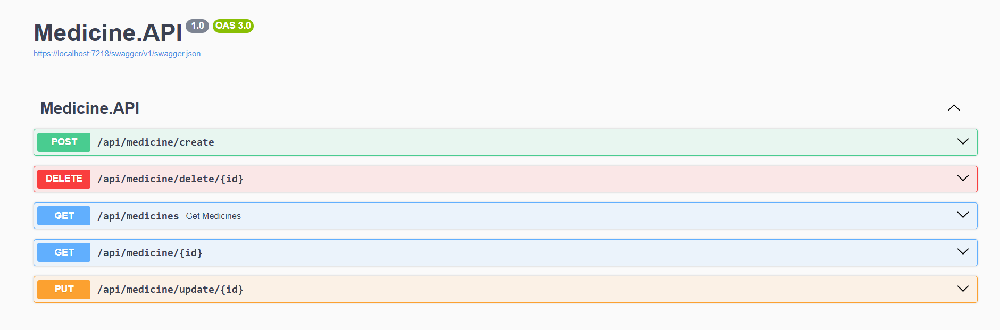

# Pharmacy App – Microservices Backend

Pharmacy App is a modern, cloud-ready medicine management platform built using a microservices architecture. This project demonstrates advanced backend engineering practices and is designed for scalability, maintainability, and extensibility in the pharmacy domain.

## Key Features
- **Microservices Architecture:** Each business domain (Medicine, etc.) is implemented as an independent .NET service, enabling modular development and deployment.
- **.NET 8 & C#:** Leverages the latest .NET and C# features for performance, reliability, and productivity.
- **Clean Architecture & DDD:** Codebase is organized around business domains, promoting a rich and expressive domain model with clear separation of concerns.
- **OpenAPI/Swagger:** Modern, lightweight HTTP APIs for fast and efficient endpoints, fully documented.
- **Dependency Injection:** Promotes testability and loose coupling throughout the solution.

## Solution Structure
- `Services/`: Contains core microservices (Medicine.API, etc.) each with their own domain, data, and API layers.
- `BuildingBlocks/`: Shared libraries and abstractions for cross-cutting concerns.

## API Endpoints Screenshot

## Skills Demonstrated
- Advanced .NET and C# development
- Microservices and distributed systems
- Domain-driven and clean architecture
- API design with REST, OpenAPI/Swagger

## Getting Started
1. Clone the repository
2. Configure environment variables and connection strings (see appsettings.json and UserSecrets)
3. Run database migrations for each service
4. Start services using `dotnet run` or Docker Compose
5. Explore the API endpoints using Swagger UI

