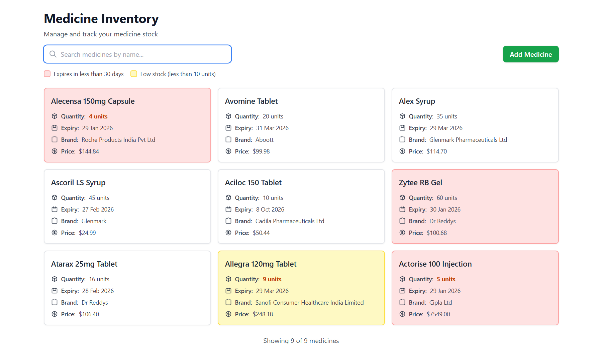
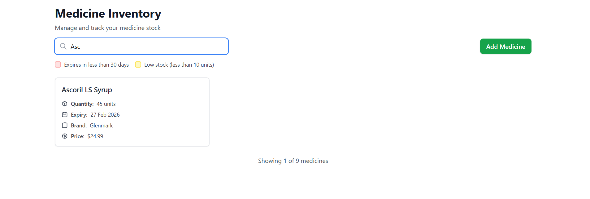

# Pharmacy App Frontend
Welcome to my Pharmacy App project! This is a modern, full-featured medicine management web application built to showcase my skills in frontend engineering, state management, and scalable architecture using the latest technologies.

## 🚀 Project Overview
Pharmacy App is a responsive platform for managing medicines, designed with a focus on user experience, accessibility, and maintainability. The project demonstrates advanced React development, TypeScript best practices, and robust state management with Redux Toolkit.

## 🛠️ Tech Stack
- **Vite** – Lightning-fast build tool for modern web projects
- **React** – Component-based UI library
- **TypeScript** – Type-safe, scalable JavaScript
- **Tailwind CSS** – Utility-first CSS framework
- **Redux Toolkit** – Predictable, scalable state management
- **ESLint & Prettier** – Code quality and formatting

## ✨ Key Features
- Medicine CRUD: Create, view, update, and delete medicines
- Responsive Design: Mobile-first, works seamlessly across devices
- API Integration: Modular API client architecture for scalable backend integration
- State Management: Advanced usage of Redux Toolkit for medicines
- Type Safety: End-to-end TypeScript for reliability and maintainability
- Reusable Components: Modular, accessible, and well-tested UI components

## 🧑‍💻 Skills Demonstrated
- Modern React Patterns: Hooks, context, 
- Advanced State Management:  Redux Toolkit
- TypeScript Mastery: Custom types, interfaces, and generics for robust code
- UI/UX Design: Tailwind CSS for maintainable, scalable layouts
- Testing & Quality: Linting, formatting, and scalable folder structure


## 📂 Project Structure
The codebase is organized for scalability and maintainability:

- `src/components/` – Reusable UI components (MedicineCard, Loader, Error, etc.)
- `src/pages/` – Route-based pages (Home, MedicineCreate, MedicineDetails, MedicineUpdate)
- `src/redux/` – Redux Toolkit slices for state management
- `src/types/` – TypeScript types and interfaces
- `src/data/` – Mock data for development
- `src/assets/` – Images, fonts, and styles

## 📸 Screenshots


## 📝 Getting Started

Install dependencies:
```sh
npm install
```

Start the development server:
```sh
npm run dev
```

Open in browser: Visit http://localhost:5173
